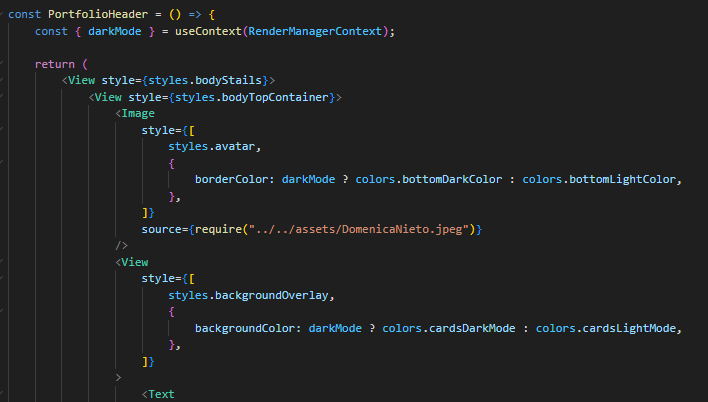

## Componentes

Esta sección describe todos los componentes de la aplicación, cómo se utilizan y su propósito dentro del proyecto, como dar formato, cabecera de información personal y cabecera de la app.

### Header.tsx
El componente Header.tsx es responsable de renderizar la barra de navegación superior. Contiene un icono que permite alternar entre el modo oscuro y modo claro, así como un enlace a la pantalla principal si la app está renderizada.

---
### PortfolioHeader.tsx
El componente PortfolioHeader se utiliza como parte de la estructura de las pantallas dentro de las pestañas, donde actúa como la cabecera de las pantallas de información personal (CV) y el repositorio. Se coloca sobre la barra de navegación de las pestañas para proporcionar una identidad visual única al portfolio.

---
### PersonalInfo.tsx
El componente PersonalInfo es contiene el formato de las cartas de de información del usuario, además de la infromación que contendra cada uno de los fromatos.

# *DATOS*
- Proyectos
- Habilidades Blandas
- Tecnologías

- Regresar _**Manual del programa**_ [<<**aquí**>>](MANUAL_PROGRAMA.md) 