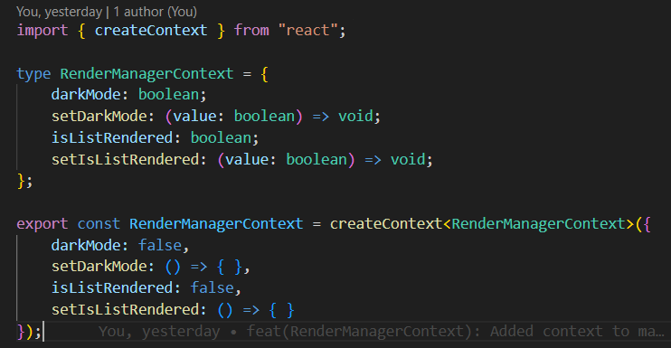
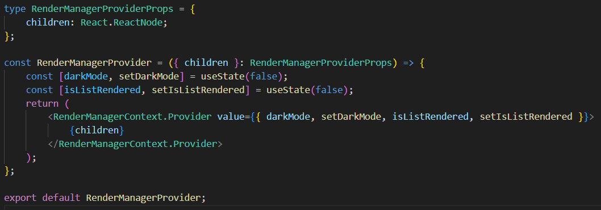

## Contexto globlal

Esta sección contiene todos los archivos relacionados con el manejo del estado global de la aplicación. Aquí se centralizan los estados que pueden ser compartidos entre diferentes componentes y pantallas de la aplicación.

---
#### RenderManagerContext.tsx
Este archivo define el contexto global RenderManagerContext para gestionar el estado de la aplicación, como el modo oscuro y el estado de la app renderizada.

---
### RenderManagerProvider.tsx 
El archivo RenderManagerProvider.tsx es el proveedor del contexto, que envuelve la aplicación para que todos los componentes puedan acceder a los valores del estado global.

- Regresar _**Manual del programa**_ [<<**aquí**>>](MANUAL_PROGRAMA.md) 