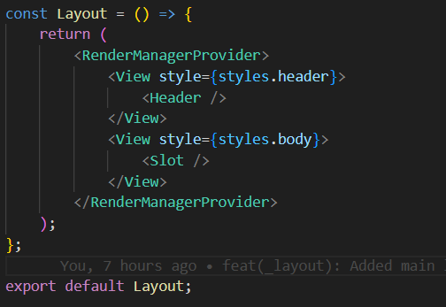
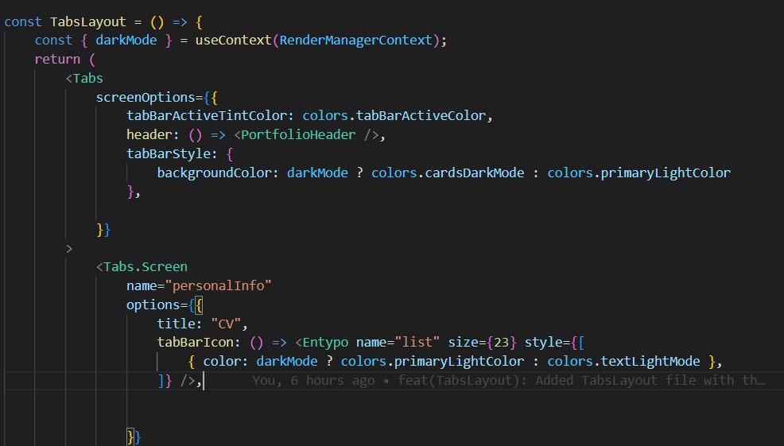

## Contexto globlal

En esta sección se explica cómo se organiza la disposición de los elementos en las vistas, además de cómo se gestionan los encabezados, pies de página, la estructura general y rutas.

---
## Layout.tsx
Este es el componente principal de la estructura de la aplicación. Contiene el Header y el espacio para el contenido dinámico que será renderizado usando Slot de expo-router.

---
## TabsLayout
absLayout configura las rutas para las pestañas, el encabezado se configura como parte de las opciones de cada pantalla en la barra de navegación.

- Regresar _**Manual del programa**_ [<<**aquí**>>](MANUAL_PROGRAMA.md) 