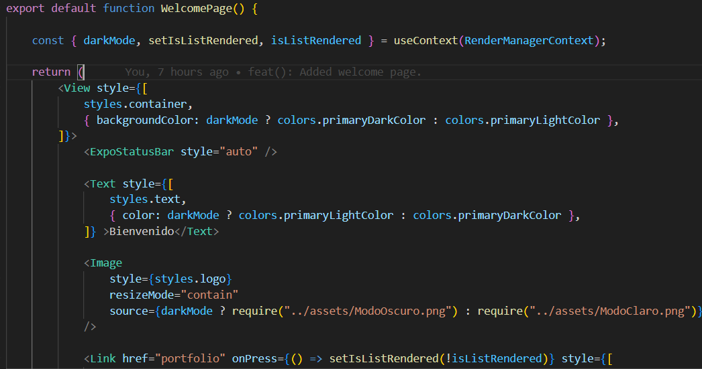
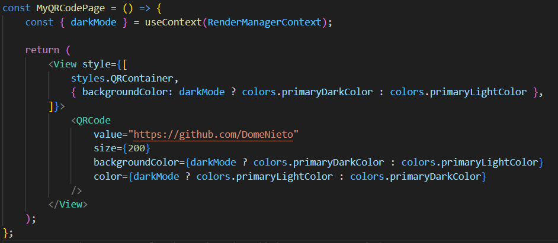

## Páginas/Pantallas

Las páginas o pantallas corresponden a las vistas principales de la aplicación, como las secciones del portfolio o el repositorio. En esta sección se detallan cada una de las pantallas, su funcionalidad y cómo interactúan con los componentes y el contexto global.

---
### WelcomePage.tsx
La pantalla de bienvenida muestra un mensaje de bienvenida, una imagen que cambia según el tema visual seleccionado, y un enlace que lleva a la sección principal del portfolio.

---
### InfoListPage

InfoListPage es una pantalla dentro del portfolio que organiza y muestra el contenido del CV o portafolio de manera estructurada. 
La página contiene diferentes secciones, como:

- Tecnologías
- Habilidades Blandas
- Proyectos
- Idiomas
- Contacto

---
### MyQRCodePage

MyQRCodePage es una pantalla dentro del portfolio que muestra el código QR que se redirige al repositorio de GITHUB del usuario.

- Regresar _**Manual del programa**_ [<<**aquí**>>](MANUAL_PROGRAMA.md) 