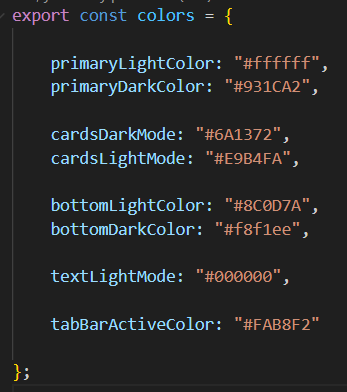

## Estilos

Los estilos de la aplicación definen la apariencia visual de la interfaz. 
Almacena los colores de la app en sus dos estados, para modo clara y oscuro.
Colores: Morado, en diferentes tonalidades, blanco y negro

- Regresar _**Manual del programa**_ [<<**aquí**>>](MANUAL_PROGRAMA.md) 